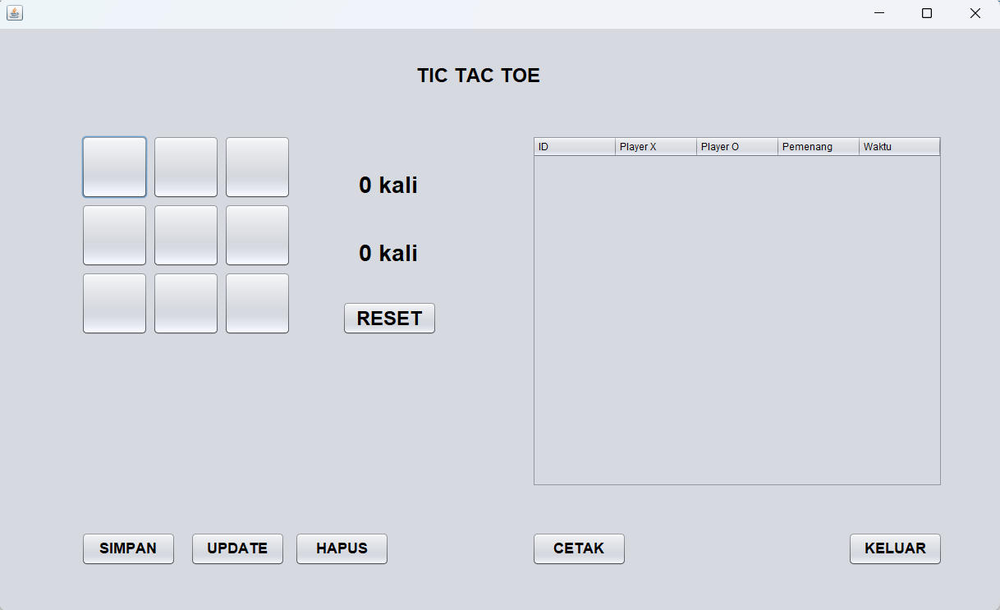
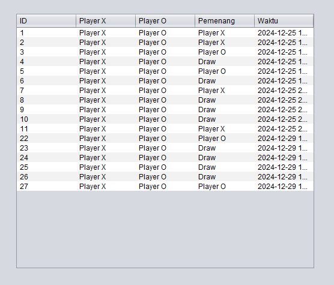
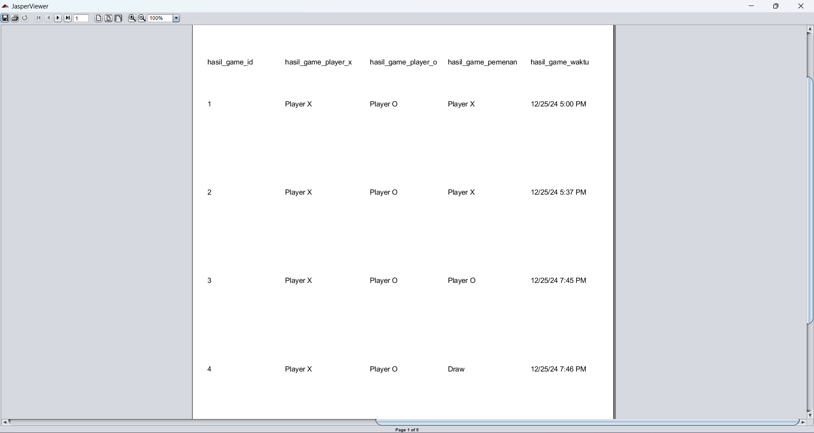

# Tic-Tac-Toe Game with Database Integration

A Java-based Tic-Tac-Toe game with a database integration providing a competitive edge for players through detailed game history and analytics.

## Features

- **Interactive Gameplay**: Play Tic-Tac-Toe with a visually appealing graphical interface.
- **Game History**: Automatically save every game result (players, winner, and timestamp) to the database.
- **Edit and Delete History**: Update or delete records directly from the game interface.
- **Data Visualization**: Generate detailed game reports using iReport for better analytics.
- **Reset and Exit**: Easily restart or exit the game for seamless user experience.

## Requirements

- **Java Development Kit (JDK)** 8 or later
- **MySQL Server** 5.7 or later
- **JasperReports Library** for report generation
- **MySQL Connector** for Java (JDBC driver)

## Installation

1. **Clone the Repository**
   ```bash
   git clone https://github.com/username/tic-tac-toe-game.git
   cd tic-tac-toe-game
   ```

2. **Set Up the Database**
   - Create a MySQL database named `db_tictactoe`.
   - Execute the `db_tictactoe.sql` script in the repository to set up the required tables.
     ```sql
     CREATE TABLE hasil_game (
         id INT AUTO_INCREMENT PRIMARY KEY,
         player_x VARCHAR(50),
         player_o VARCHAR(50),
         pemenang VARCHAR(20),
         waktu TIMESTAMP DEFAULT CURRENT_TIMESTAMP
     );
     ```

3. **Configure Database Connection**
   - Update the `Koneksi.java` file with your MySQL credentials:
     ```java
     String url = "jdbc:mysql://localhost:3306/db_tictactoe";
     String user = "root";
     String password = "";
     ```

4. **Add Required Libraries**
   - Include the following `.jar` files in your project:
     - `mysql-connector-java-x.x.x.jar`
     - `jasperreports-x.x.x.jar`
     - Any other dependencies required for JasperReports.

5. **Run the Project**
   - Open the project in your preferred Java IDE (e.g., NetBeans or IntelliJ IDEA).
   - Compile and run the main class to start the game.

## How to Use

1. **Gameplay**:
   - Start the game and select your moves as Player X or Player O.
   - The winner will be determined automatically after each game.

2. **Game History**:
   - View the detailed history of games, including players, winners, and timestamps.
   - Use buttons to update or delete specific records.

3. **Generate Report**:
   - Click the "iReport" button to view and export game statistics.

4. **Reset and Exit**:
   - Use the "Reset" button to restart the game or "Exit" to close the application.

## Project Structure

```plaintext
src/
├── Project/
│   ├── BP1_M10_20230810111_LutfiFaiz_TicTacToe.java  # Main game logic
│   ├── Koneksi.java                                  # Database connection class
│   └── laporan/                                      # Report templates (JRXML/Jasper files)
├── lib/                                              # External libraries (.jar files)
├── db_tictactoe.sql                                  # SQL script for database setup
```

## Screenshots

### Game Interface


### Game History


### Report Generation


## Future Improvements

- Implement player statistics and leaderboard.
- Add multiplayer mode with real-time updates.
- Enhance UI with animations and sound effects.

## Contributing

Contributions are welcome! Please create a pull request or submit issues for bugs and feature requests.

## License

This project is licensed under the [MIT License](LICENSE).

Copyright &copy; 2024-2025 Lutfi Faiz Ziyadatullah. All rights reserved.
